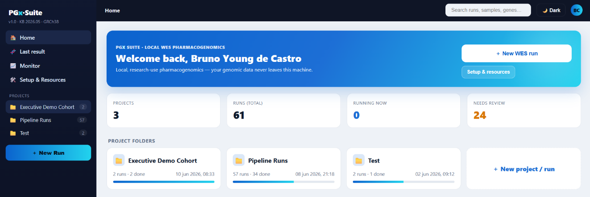
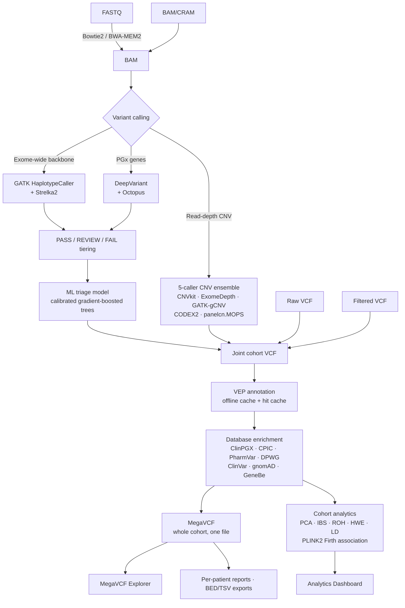
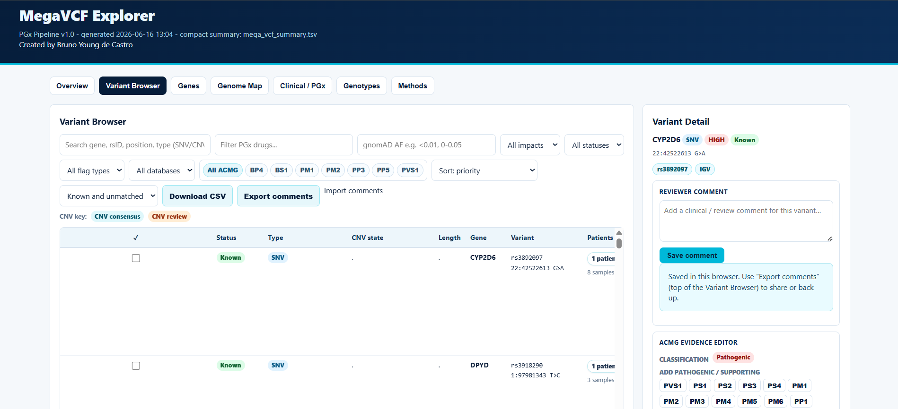
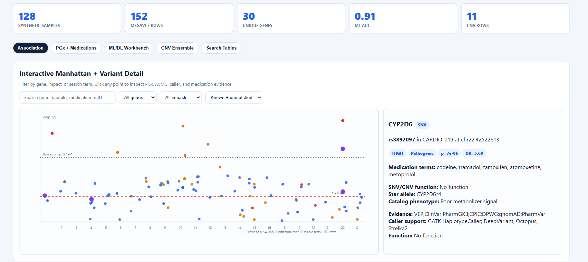

# PGX Pipeline — an end-to-end pharmacogenomics platform for WES cohorts

**FASTQ → aligned reads → SNV/indel + CNV calls → VEP annotation → pharmacogenomic database
enrichment → cohort analytics → an interactive variant browser a researcher can actually use.**

Built solo during my M1 GENIOMHE (AI & Bioinformatics) internship of Université Paris-Saclay /
Université Évry, in a clinical pharmacogenomics lab (Grupo Duponte).

> **This is a showcase repository.** It contains documentation, results, figures, two live
> interactive demos, and selected source excerpts. The full pipeline (~1.5 MB of Python across
> 40+ modules) is private. Everything shown here runs on **synthetic data** — no patient data
> appears anywhere in this repo.

---

## 🔬 Try it — two live, interactive demos

These are real, unmodified outputs of the pipeline, generated from a synthetic 128-sample cohort.
Both are self-contained single-page apps: search, filter, click points, open variant cards.

| Demo | What to look at |
|---|---|
| **[MegaVCF Explorer →](https://Zyrok12.github.io/pgx-showcase/demo/mega_vcf_explorer.html)** | Search `CYP2D6`. Click a variant. You get ACMG criteria with a live evidence editor, CPIC/DPWG/PharmGKB drug guidance, star alleles, population frequencies, caller support and per-sample genotypes — for the whole cohort in one file. |
| **[Analytics Dashboard →](https://Zyrok12.github.io/pgx-showcase/demo/analytics_dashboard_interactive.html)** | Click any point above the Bonferroni line on the Manhattan plot — a detail card opens with the PGx evidence for that variant. Then open the *PGx + Medications* tab and click `clopidogrel`. |
| [Static figure dashboard →](https://Zyrok12.github.io/pgx-showcase/demo/analytics/analytics_dashboard.html) | The publication-ready matplotlib figure set, with methods and interpretation notes per section. |

---

## Why I built this

I was assigned a project on genetic variants associated with response and non-response to
platinum-salt chemotherapy in lung cancer. I couldn't start it.

The lab sequenced patient blood samples in-house on an Illumina NextSeq 2000, but:

- **No CNV calling.** The instrument's CNV option wasn't licensed, so copy-number variants —
  which matter enormously in pharmacogenes — were simply never looked at.
- **Bioinformatics was outsourced.** Everything between raw reads and tertiary analysis went to
  an external company. Results took **months**, and came back incomplete or wrong often enough
  that they had to be re-requested.

So the biology project was blocked on a data-engineering problem. I built the missing
infrastructure instead: a **fully local** pipeline that takes the lab from FASTQ to
interpretation-ready evidence without patient data ever leaving the building, and without
waiting on anyone.

---

## What it does

<p align="center">
  
</p>



Four entry points — **FASTQ**, **BAM/CRAM**, **raw VCF**, or **filtered VCF** — so a lab that
already has aligned data or existing calls can jump straight to annotation and analytics.

Full detail in **[docs/ARCHITECTURE.md](docs/ARCHITECTURE.md)** and
**[docs/METHODS.md](docs/METHODS.md)**.

---

## Results

Two independent validations: a synthetic cohort with a known truth set, and NIST/GIAB HG002.
Full breakdown in **[docs/RESULTS.md](docs/RESULTS.md)**.

### Variant calling beats every standalone caller it's built from

F1 on GIAB HG002, whole-exome:

| Caller | F1 |
|---|---:|
| GATK HaplotypeCaller | 0.902 |
| Strelka2 | 0.909 |
| DeepVariant | 0.911 |
| PGX ensemble (PASS tier only) | 0.907 |
| **PGX ensemble + ML triage** | **0.929** |

### Synthetic cohort, known truth set

| | SNV / indel | CNV |
|---|---:|---:|
| Truth variants | 259 | 24 |
| True positives | 257 | 23 |
| **False positives** | **0** | **0** |
| False negatives | 2 | 1 |
| **F1** | **0.996** | **0.978** |

The 2 missed SNVs sat inside a homozygous deletion — correct non-calls. The missed CNV was a
heterozygous duplication, the hardest class to detect from WES read depth.

**Zero false positives in both validations** is the design goal, not a coincidence: clinical
research conclusions must never rest on variants that don't exist.

### The ML triage model is where the gain comes from

Ensemble calling alone gives 0.907. The triage model takes it to 0.929.

| Metric | Value |
|---|---:|
| F1 gain, GIAB HG002 | **+0.022** |
| F1 gain, synthetic cohort | **+0.024** (0.972 → 0.996) |
| AUROC | 0.80 |
| AUPRC | 0.97 |
| REVIEW variants rescued → PASS | 1,373 |
| REVIEW variants dropped → FAIL | 215 |
| Kept as REVIEW | 134 |

AUROC 0.80 with AUPRC 0.97 is the interesting shape: the model's *ranking* is decent, but the
variants it actually promotes are almost never artifacts. That's exactly the behaviour you want
when the cost of a false positive is a wrong biological conclusion.

---

## Two pieces of engineering I'd point a reviewer at

### 1. A 5-caller CNV ensemble that's honest about breakpoints

WES CNV calling is genuinely hard: you only see captured exons, so a deletion starting in an
intron has invisible edges. Single callers disagree constantly.

The ensemble ([design notes](docs/ARCHITECTURE.md#cnv-ensemble)):

1. **Merge within-caller first.** Fragmented adjacent bins from one caller collapse into one
   event *before* voting — otherwise a high-resolution caller casts five votes for what is
   biologically one CNV and dominates the result.
2. **Cluster across callers** by sample, chromosome, direction, interval overlap, and shared
   gene/target evidence.
3. **One vote per caller per event.** 5/5 → consensus PASS. 3–4/5 → REVIEW. <3 → dropped.
4. **Report breakpoint uncertainty instead of faking precision** — reported interval,
   target-confirmed core, outer supported span, affected exons, and an explicit precision flag
   are all separate fields.

Deliberately mixing bin-based callers (ExomeDepth, CODEX2, panelcn.MOPS at 250 bp) with
target-based ones (CNVkit, GATK-gCNV, sometimes whole-gene) means the two failure modes don't
correlate.

Population frequency (gnomAD-CNV, DGV, DECIPHER) is attached as **annotation only** and never
filters a CNV out — a common CNV can still differ between responders and non-responders.

### 2. A calibrated gradient-boosted tree that rescues real variants from the REVIEW tier

**→ [`code-excerpts/review_triage_model.py`](code-excerpts/review_triage_model.py) — complete,
runnable, ~300 lines.**

```bash
python code-excerpts/review_triage_model.py --demo
```

Hard quality thresholds throw away real variants. GATK's own filters cap out at F1 0.902 on
GIAB — many of the calls they discard are genuine, just borderline. That's especially damaging in
pharmacogenes, which sit next to pseudogenes and near-identical paralogs and therefore *always*
look borderline.

So instead of one hard cut, calls are tiered PASS / REVIEW / FAIL, and a model re-scores the
REVIEW tier into P(real):

- Features: `QUAL, QD, FS, SOR, MQ, MQRankSum, ReadPosRankSum, BaseQRankSum, DP, GQ`,
  allele balance from AD, `is_indel`, indel length.
- Model: `HistGradientBoostingClassifier(max_depth=3, learning_rate=0.05, max_iter=300,
  l2_regularization=1.0)` wrapped in `CalibratedClassifierCV(method="isotonic")` — calibration
  matters because the thresholds are probabilities, not scores.
- Labels come free: every call in a GIAB run is TP/FP-labelable against the NIST truth set.
- Decision: P ≥ 0.70 → rescue to PASS. P < 0.30 → drop to FAIL. Otherwise stay REVIEW.
- **Validation splits by whole chromosome**, not randomly, so nearby variants can't leak between
  train and test. The rescue threshold is re-tuned on the training fold each time and applied
  blind to the held-out fold — no threshold-peeking.

It's measured against two deliberately dumb baselines — keep-all-REVIEW and drop-all-REVIEW —
because "the model helps" only means something relative to doing nothing.

---

## The output researchers actually touch

The point of all this is that a researcher opens **one file** and has everything.

<p align="center">
  
</p>

**MegaVCF** joins every variant across the whole cohort — SNVs, indels, and symbolic CNVs
(`<DEL>`/`<DUP>`) — into a single VCF, then renders a self-contained HTML explorer over it. No
server, no install; it opens in a browser and works offline.

Per variant you get consequence and impact, ACMG classification **with an editor that recomputes
the class live when you add evidence**, CPIC/DPWG/PharmGKB drug guidance, PharmVar star alleles,
gnomAD frequencies by population, ClinVar significance, which callers supported the call, and
which samples carry it. Reviewer comments and filtered exports are built in.

<p align="center">
  
</p>

The **analytics dashboard** covers population structure (PCA, IBS, ROH), QC (heterozygosity, call
rate, depth and breadth at 1×/10×/20×, Ti/Tv, HWE, allele-frequency spectrum), association
(PLINK2 logistic regression with Firth penalisation → Manhattan, QQ, forest, gene-signal), and
LD plus a PGx-readiness heatmap showing which pharmacogenes are actually covered well enough to
trust.

Interactive plots are Plotly; publication-ready static figures are matplotlib; statistics are
SciPy and PLINK2. [More figures →](figures/)

---

## Tech stack

**Language** Python 3.11 · pandas · NumPy · scikit-learn · SciPy · Plotly · matplotlib · PyTorch (optional)

**Genomics** Bowtie2 · BWA-MEM2 · samtools/bcftools · GATK4 · Strelka2 · DeepVariant · Octopus ·
CNVkit · ExomeDepth · GATK-gCNV · CODEX2 · panelcn.MOPS · Ensembl VEP · PLINK2 · PyPGx

**Knowledge bases** ClinPGX · CPIC · PharmGKB · PharmVar · DPWG · ClinVar · gnomAD · GeneBe ·
DGV · DECIPHER · OMIM · Reactome · DrugBank

**Delivery** local web UI (server + single-page app) · conda environment · Docker · per-run
manifests with tool versions and content hashes for reproducibility · stage checkpointing with
resume/retry · preflight validation that fails in seconds instead of four hours in

---

## What's in this repository

```
README.md                    you are here
docs/
  ARCHITECTURE.md            pipeline stages, CNV ensemble design, module layout
  METHODS.md                 calling, tiering, annotation, enrichment, analytics
  RESULTS.md                 full validation numbers and how they were produced
  PUBLISHING.md              how to enable Pages and refresh the demos
  demo/                      the two live interactive demos + figure dashboard
figures/                     13 annotated screenshots (synthetic cohort)
code-excerpts/
  review_triage_model.py     the ML triage model, verbatim and runnable
  README.md                  what's excerpted and what isn't
scripts/refresh_demo.sh      regenerate docs/demo from a completed pipeline run
```

---

## Status and honest limitations

This is **research-use-only software**, and it isn't finished.

- No clinical validation has been performed. Nothing here is a diagnostic device, and every
  output needs expert review before it informs anything.
- WES CNV breakpoints are read-depth estimates. Single-exon events can be real but need caution.
- Small cohorts give weak CNV reference structure.
- Association results are research signals — ancestry structure, capture bias, missingness and
  multiple testing all have to be weighed.
- Star-allele calling is limited by WES capture, paralogy and phasing.

**In progress:** star-allele/haplotype calling validated against CDC GeT-RM consensus; a deep
learning model to predict function and dosing for *novel* pharmacogene variants (known ones just
look up CPIC); and extending toward multi-omics, starting with transcriptomics.

---

## License and contact

The showcase content in this repository is © 2026 Bruno Young de Castro — see [LICENSE](LICENSE).
The full pipeline source is private and not licensed for redistribution.

Happy to walk through the architecture, the validation design, or the parts I'd rebuild
differently.

**Bruno Young de Castro** — [LinkedIn](https://www.linkedin.com/in/brunoyoungdecastro) · <brunoyc@icloud.com>

*Internship supervised by Marta Martín, PhD (host lab) and Valérie Chaudru, PhD
(Université Paris-Saclay / Université Évry).*
