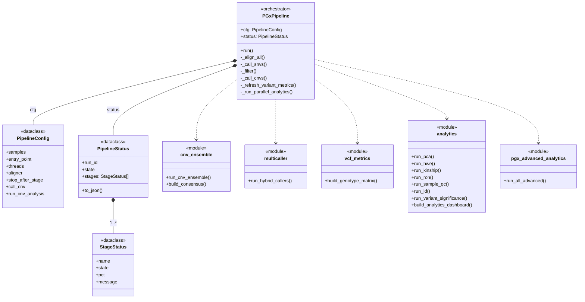

# Architecture

How the PGX pipeline is put together: the run model, the stage graph, the CNV ensemble design,
and the module layout.

- [Run model](#run-model)
- [Stage graph](#stage-graph)
- [Entry points](#entry-points)
- [SNV and indel calling](#snv-and-indel-calling)
- [Quality tiering](#quality-tiering)
- [CNV ensemble](#cnv-ensemble)
- [Annotation and enrichment](#annotation-and-enrichment)
- [MegaVCF](#megavcf)
- [Module layout](#module-layout)
- [Operational design](#operational-design)

---

## Run model

The pipeline is a local application, not a cluster job. A Python server hosts a single-page web
UI; runs are launched from the browser and execute on the same machine. Genomic data never
leaves the host — which is the entire point for a lab handling patient samples.

Each run gets an immutable folder, an optional human-readable label, and a stable run ID:

```
runs/<run_id>/results/
  annotation/          VEP output, CNV VEP annotation
  analytics/           cohort statistics and plots
  advanced_analytics/  PGx-specific and CNV-specific outputs, ML workbench
  bam/                 processed alignments
  bed/                 BED exports and the run-local target file
  cnv/                 per-caller CNV output and ensemble tables
  db_enrichment/       enriched variant tables
  logs/                per-stage logs
  mega_vcf/            MegaVCF and the Explorer HTML
  patient_reports/     per-patient reports
  prioritization/      PGx prioritisation output
  qc/                  FASTQ / BAM / VCF / coverage QC
  variants/            cohort VCFs, variant table, genotype matrix
  run_manifest.json    provenance
```



## Stage graph

A full FASTQ run executes 19 stages. Each writes a checkpoint, so an interrupted run resumes
where it stopped rather than restarting.

| # | Stage | Notes |
|---:|---|---|
| 1 | Run setup, tool and resource checks | preflight gate; fails in seconds, not hours |
| 2 | Input resolution, run folder creation | |
| 3 | Target BED preparation | capture BED → run-local CNV target map |
| 4 | Reference index check / build | GRCh38 |
| 5 | Alignment | Bowtie2 or BWA-MEM2 |
| 6 | Duplicate marking | |
| 7 | BQSR | optional |
| 8 | SNV / indel calling | region-dependent caller pairs |
| 9 | Joint genotyping and filtering | PASS / REVIEW / FAIL tiering |
| 10 | CNV ensemble calling | five callers, voted |
| 11 | VEP annotation | offline cache, with a persistent hit cache |
| 12 | Variant prioritisation | PGx catalogue |
| 13 | Database enrichment | public APIs and local resources |
| 14 | CNV analytics | |
| 15 | ACMG-style research classification | where configured |
| 16 | MegaVCF + Explorer generation | |
| 17 | Star allele, diplotype and phenotype layers | where enabled |
| 18 | QC and cohort analytics | |
| 19 | BED exports, HTML reports, completion | |

Stage-level retry is supported without rerunning what came before — for example re-running VEP
annotation on existing calls rather than realigning from FASTQ.

## Entry points

Labs are rarely starting from scratch, so there are four ways in:

| Entry point | Use case | Runs from |
|---|---|---|
| FASTQ | full raw-read pipeline | stage 5 |
| BAM/CRAM | already-aligned samples | stage 8 |
| Raw VCF | existing unfiltered calls | stage 9 |
| Filtered VCF | existing PASS-ready calls | stage 11 |

## SNV and indel calling

Rather than trusting one caller everywhere, the exome is split into two regions and each gets a
pair of callers chosen for complementary strengths.

**Exome-wide backbone** (>90% of the exome)
- **GATK HaplotypeCaller** — Bayesian local de-novo assembly to resolve haplotypes.
- **Strelka2** — a probabilistic mixture model, used here as a precision check on GATK.
- Agreement → consensus tier flag. GATK alone → `GATK only` flag.

**Pharmacogene regions**
- **DeepVariant** — a CNN over pileup images, which picks up patterns statistical models miss.
  This matters because pharmacogenes are surrounded by pseudogenes and near-identical copies.
- **Octopus** — a Bayesian haplotype graph, notably better in repetitive, variant-dense regions,
  used to confirm DeepVariant.

## Quality tiering

Calls are tiered rather than hard-filtered, so borderline variants get flagged for a human
instead of silently disappearing.

| Metric | PASS | REVIEW | FAIL |
|---|---|---|---|
| Quality by Depth (QD) | > 2.0 | < 2.0 | < 1.0 |
| Fisher Strand (FS) | < 60 | > 60 | > 100 |
| Strand Odds Ratio (SOR) | < 3.0 | > 3.0 | > 5.0 |
| Mapping Quality (MQ) | > 30 | < 30 | < 20 |
| MQ Rank Sum | > −12.5 | < −12.5 | < −20 |
| Read Position Rank Sum | > −8.0 | < −8.0 | < −15 |

The REVIEW tier is then re-scored by the [ML triage model](../code-excerpts/review_triage_model.py).
See [RESULTS.md](RESULTS.md#triage-model) for what that buys.

## CNV ensemble

WES CNV calling is the hardest part of the pipeline. Capture data is noisy, coverage is uneven by
design, and breakpoints frequently fall in unsequenced introns. The response is a five-caller
consensus.

| Caller | Model | Resolution |
|---|---|---|
| **CNVkit** | circular binary segmentation over exonic reads | per-target |
| **ExomeDepth** | beta-binomial, with a panel of normals built from the cohort | 250 bp bins |
| **GATK-gCNV** | Bayesian, models systematic bias and GC content | per-target |
| **CODEX2** | Poisson, strong noise suppression across WES samples | 250 bp bins |
| **panelcn.MOPS** | cohort-wide rank and depth shifts | 250 bp bins |

Mixing bin-based and target-based callers is deliberate: their failure modes are different, so
agreement between them means more than agreement between five similar tools.

**The voting pipeline:**

1. **Within-caller merge.** Fragmented adjacent bins from the *same* caller are merged into one
   event before voting. Without this a 250 bp-bin caller casts five votes for one biological CNV
   and swamps the target-based callers.
2. **Cross-caller clustering.** Calls group by sample, chromosome, CNV direction, interval
   overlap, and shared gene/target evidence. Clusters also merge on ≥50% reciprocal overlap.
3. **One vote per caller per event.** Bin-level calls from one caller collapse to a single span
   first, so high-resolution callers can't dominate the reported breakpoints.
4. **Confidence assignment.**
   - 5/5 callers → **consensus PASS**
   - 3–4/5 → **REVIEW**
   - 1–2/5 → raw evidence only, not emitted as a call
5. **Exclusivity.** Overlapping deletion and duplication calls in the same sample can't both pass.
6. **Reporting.** Breakpoints are given as a median across per-caller spans, alongside the
   target-confirmed core, the outer supported span, affected targets and exons, and an explicit
   breakpoint-precision field.

**Two design decisions worth calling out:**

- **Breakpoint honesty.** Reported interval, target-confirmed region, outer span, affected
  targets, affected exons and precision are separate fields. WES does not give base-pair
  breakpoints and the output doesn't pretend otherwise.
- **Population frequency is annotation, never a filter.** gnomAD-CNV, DGV and DECIPHER are
  attached for context but never exclude a CNV from calling, MegaVCF, or association testing. A
  common CNV can still differ between responders and non-responders — filtering on frequency
  would throw away exactly the signal the study is looking for.

Calls overlapping low-mappability regions are cross-referenced against a mappability BED and
tagged `Low Mappability` rather than dropped.

## Annotation and enrichment

**Normalisation first.** `bcftools norm -m -both` splits multi-allelic sites into independent
records — essential here, because pharmacogenes are heavily multi-allelic — and `-f <fasta>`
left-aligns indels against the reference so representations match the pharmacogene catalogue
during lookup.

**VEP** runs fully offline against a local cache: consequence, transcript, HGVS, gene symbol,
rsID, and gnomAD/1000 Genomes frequencies. A persistent **hit cache** stores previous
annotations and is checked before invoking VEP, so a lab's runs get faster the longer they use
the tool.

**Database enrichment** queries seven core sources, each by the key that source actually indexes
on (rsID, position, gene, or interval for structural variants):

| Source | Contributes |
|---|---|
| ClinPGX | clinical annotation + evidence level |
| CPIC | gene–drug dosing guidelines |
| PharmVar | star-allele identification |
| DPWG | dosing guidelines |
| ClinVar | clinical significance |
| gnomAD | population allele frequencies |
| GeneBe | ACMG classification + evidence |

Results from multiple sources for one variant merge into a single row. Variants with no hit
anywhere are tagged **novel** and carry deep links out to sources the pipeline doesn't query
directly (LOVD, OMIM, DrugBank, Reactome, ClinGen) so a reviewer can follow up in one click.

Enrichment **annotates, it never drops**.

## MegaVCF

The cohort-level artifact. One VCF holding every variant from every sample — SNVs, indels, and
symbolic CNVs (`<DEL>`, `<DUP>`) — plus per-sample genotypes, VEP annotation, PGx prioritisation,
database evidence, CNV caller support and context, and association p-values where available.

From it the pipeline renders `mega_vcf_explorer.html`: a **self-contained** single-file browser
app. No server, no dependencies, works offline, opens by double-click. It carries a variant
browser with faceted filtering, a genome map, a medication view, per-sample genotypes, an ACMG
evidence editor that recomputes classification live, reviewer comments persisted in the browser,
and filtered CSV export.

That "one file" property is the difference between a researcher reviewing a cohort and a
researcher juggling 128 VCFs.

## Module layout

~40 Python modules. The largest, by weight:

| Module | Role |
|---|---|
| `engine.py` | stage orchestration, checkpointing, resume/retry |
| `mega_vcf.py` | MegaVCF construction and the Explorer app |
| `db_enrichment.py` | database clients, merging, novelty tagging |
| `analytics.py` | PCA, LD, HWE, kinship, ROH, QC, association, dashboard |
| `cnv_ensemble.py` | five-caller merge, clustering, voting, reporting |
| `db_downloader.py` | resource acquisition and status tracking |
| `ml_workbench.py` | responder classifiers, embeddings, permutation checks |
| `pgx_advanced_analytics.py` | metabolizer, pathway and drug-oriented layers |
| `acmg_classify.py` | ACMG/AMP criteria evaluation |
| `preflight.py` | pre-run validation with actionable failure messages |
| `star_allele.py`, `diplotype_phenotype.py` | star alleles, diplotypes, phenotypes |
| `multicaller.py` | region-aware hybrid SNV/indel calling |
| `review_triage_dl.py` | the ML triage model ([excerpted](../code-excerpts/review_triage_model.py)) |
| `interactive_plots.py`, `html_report.py`, `report_pdf.py` | Plotly dashboards, HTML and PDF reports |

## Operational design

Things that don't show up in a methods section but decide whether anyone actually uses the tool:

- **Preflight validation** — paths, formats, indexes, tools, resources, disk space and an
  estimated RAM ceiling are all checked before a run starts. Failures print the problem, the fix,
  the affected stage and the resume point. A four-hour run should not die on a missing index.
- **Checkpointing and resume** — every stage checkpoints; runs resume from the UI or the API.
- **Run manifests** — each run records pipeline version, config hash, Python version, platform,
  reference and target metadata, sample names, external tool versions, and SHA-256 content hashes
  of every output file.
- **Resource wizard and profiles** — resource readiness is checkable without launching a run, and
  presets (e.g. `cnv_heavy`) apply tuned configurations.
- **Packaging** — conda environment, Docker scaffolding, and a source-free release packager.
- **Synthetic smoke test** — generates small FASTQs with known SNV and CNV truth tables and emits
  a formal expected-vs-detected report. This is what produced the synthetic validation numbers in
  [RESULTS.md](RESULTS.md).
